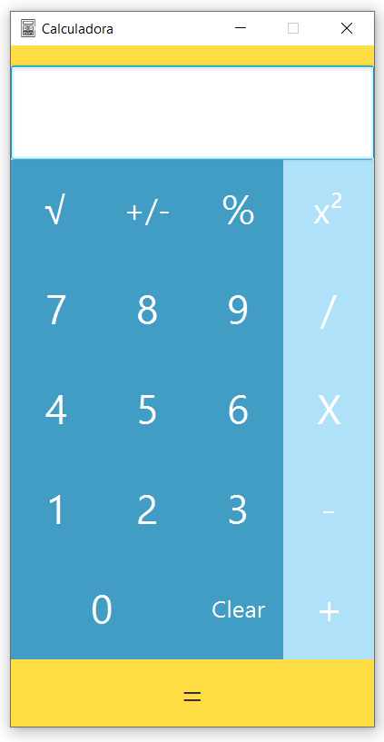

# Calculadora

Calculadora is a calculator application where one can perform calculations such as addition, subtraction, multiplication, division, modulo, square root and numbers squared.

<!-- PROJECT LOGO -->
<br />
<p align="center">
  <a>
    
  </a>
</p>

## Installation

Needs JavaFX 11.0.2 to run.

```bash
https://gluonhq.com/products/javafx/
```
## Known bugs and issues

* <a href="https://github.com/kasanderh/CalculatorProject/issues"> See issues for more information</a>
 

## Future Implementations

* Multiple number input
* Numbers with decimals
* History function

## Contributing
Pull requests are welcome. For major changes, please open an issue first to discuss what you would like to change.

## Credits
 * Application icon made by Freepik from www.flaticon.com
